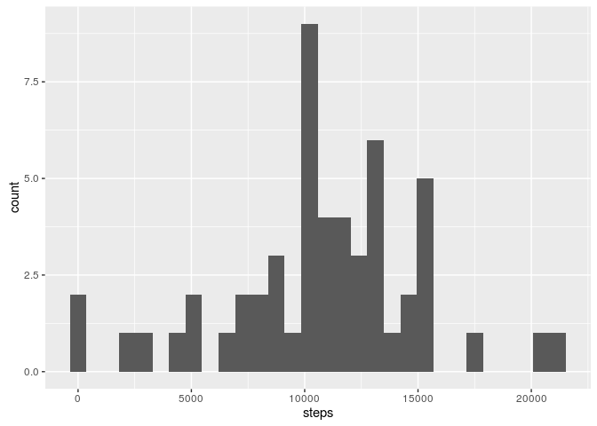
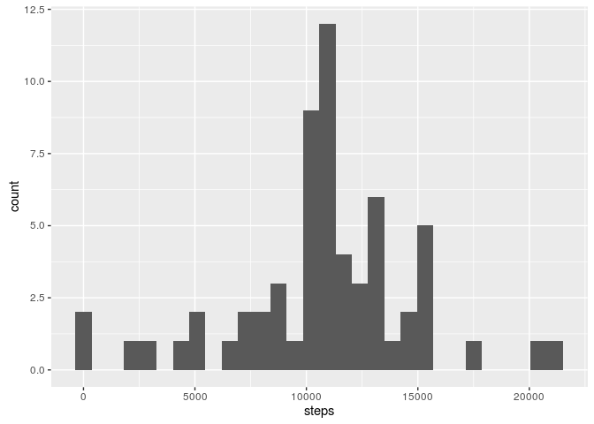
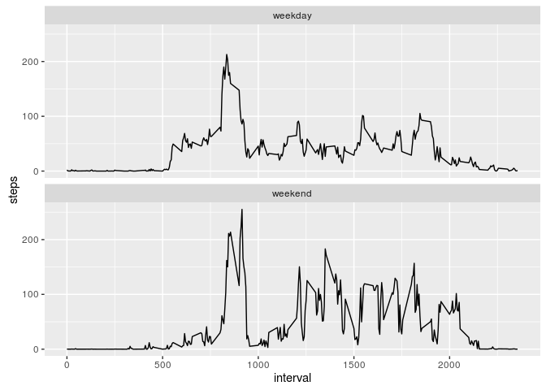

# Reproducible Research: Peer Assessment 1


## Loading and preprocessing the data

Load the raw data

```r
dat <- read.csv("activity.csv")
```

## What is mean total number of steps taken per day?

Firts I calculate the total number of steps taken per day and store these in a new variable. I omit NAs from the dataset.  

```r
library(dplyr)
steps_per_day <- filter(dat, !is.na(dat$steps)) # Remove NAs
steps_per_day <- group_by(steps_per_day, date) # Group by day
steps_per_day <- summarize(steps_per_day, steps=sum(steps)) # Calculate steps per day
```
  
Then I make a histrogram of the total number of steps taken each day.

```r
library(ggplot2)
ggplot(steps_per_day, aes(x=steps)) + geom_histogram()
```

<!-- -->
  
Finally I calculate the mean and median total number of steps taken per day.

```r
mean <- mean(steps_per_day$steps)
median <- median(steps_per_day$steps)
```
mean: 10766  
median: 10765

## What is the average daily activity pattern?

Firts I calculate the mean steps taken per interval and store these in a new variable. I omit NAs from the dataset.  

```r
library(dplyr)
steps_per_interval <- filter(dat, !is.na(dat$steps)) # Remove NAs
steps_per_interval <- group_by(steps_per_interval, interval) # Group by interval
steps_per_interval <- summarize(steps_per_interval, steps=mean(steps)) # Calculate steps mean per interval
```

Then I plot the results in a line-graph.

```r
ggplot(steps_per_interval, aes(x=interval, y=steps)) + geom_line()
```

<!-- -->

Finally, I calculate which interval has the highest steps average.

```r
library(dplyr)
max_steps <- max(steps_per_interval$steps)
max_interval <- select(filter(steps_per_interval, steps==max_steps), interval)
```
Maximum average steps are 206, which correspond to the interval 835.

## Imputing missing values
The total number of missing values in the dataset

```r
sum(is.na(dat$steps))
```

```
## [1] 2304
```

Create a function that assigns the mean value of that interval whenever an NA is present.

```r
replace_NA <- function(steps_per_interval, NA_steps, NA_interval){
    if(is.na(NA_steps)){
        as.numeric(select(filter(steps_per_interval, interval==NA_interval), steps))
    } else NA_steps 
}
```

Create a new dataframe with replacement for NA values.

```r
dat_complete <- dat
dat_complete$steps <- sapply(1:nrow(dat_complete), function(x) replace_NA(steps_per_interval, dat$steps[x], dat$interval[x]))
```

Using the adjusted dataframe, I calculate the total number of steps taken per day and store these in a new variable.

```r
library(dplyr)
steps_per_day <- group_by(dat_complete, date) # Group by day
steps_per_day <- summarize(steps_per_day, steps=sum(steps)) # Calculate steps per day
```
  
Using the adjusted dataframe, I make a histrogram of the total number of steps taken each day.

```r
library(ggplot2)
ggplot(steps_per_day, aes(x=steps)) + geom_histogram()
```

<!-- -->
  
Using the adjusted dataframe, I calculate the mean and median total number of steps taken per day.

```r
mean_complete <- mean(steps_per_day$steps)
median_complete <- median(steps_per_day$steps)
```
mean: 10766  
median: 10766
  
  
Replacing the NA values does not significantly change the mean and median:
Mean: 10766.19 vs. 10766.19     
Median: 10766.19 vs. 10765

## Are there differences in activity patterns between weekdays and weekends?

Create new factor variable with levels "weekday" and "weekend".

```r
dat_complete$weekday <- as.factor(sapply(1:nrow(dat_complete), function(x) if(as.POSIXlt(dat$date[x])$wday>5) "weekend" else "weekday"))
```

Make panel plot of weekdays and weekends.

```r
ggplot(dat_complete, aes(x=interval, y=steps)) + geom_line(stat="summary", fun.y="mean") + facet_wrap(~weekday, ncol=1)
```

<!-- -->

